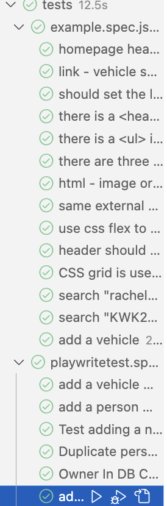

# COMP1004CW Darragh Flynn

## HTML Additional
For the additional HTML I have passed the lighthouse accesibitly test with 100%. I done this by making sure i had sufficient colour contrast between my text and background colours. This allows users with poor vision or colour blindness to easily view my website. 
I added alt attributes to all my images. 
I used semantic HTML elements such as header, nav, main, footer, ul, ect.  
I have set all the meta data of my website helping aid assistive technologies. Found in my HTML files.

## CSS Additional
For the additional CSS I have made my page responive. This allows for a better viewing experince on smaller devices. I have set the layout to move the side bar to the bottom and the nav links to be vertically stacked whenn the page is less than 500px. I used 499px in my code as it says less than (not equal) to 500px. So when the page is exactly 500px there will be no change.(Found on lines 43-53 and 121-126 in styles.css)

## JS Additional 
I have created 6 thourgh playwrite tests for my webiste, testing the functionality, error checks and data base queries. Found in playwritetests.spec.js
#### Test 1 - Add a Vehicle (missing data)
For test one I am checking that my form can only be submitted if all input feilds are filled. My test inputs data for the registation, model and colour, leaving make and owner blank. The Add vehicle button is then pressed and an 'Error' message is expected to apear on screen.

#### Test 2 - Add a Person (missing data)
This test fills out the add vehicle form with Registaion being 'FFZ1234', no errors and with an owner not already present in the database. The add vehicle page is pressed and a new add person form appears. The test will input data to the person Id, name, date of birth, license adn expiration data feilds leaving address blank. The Add Owner button will be pressed and an 'Error' message will be expected to appear. After the error message the Vehicle search page will be opened and the the input previously 'FFZ1234' will be searched for to make sure that it hasnt been input in the data base. The test will then submit the form and expect 'No result found' to be output.

#### Test 3 - Adding Vehicle (Registation already in database)
My test fills in the add vehicle form with the reg 'KWK24JI' which is already present in the data base. As the reg is a primary key in the Vehiles table this should not be inserted as to have a duplicate key. The test submits the form and awaits an output of 'Error'.

#### Test 4 - Adding Person (duplicate personID)
Fills out the add vehicle form with no errors and registartion of 'DRZ12345'. Then fills in the person form with a personID of 1, which is already present in the database. The add owner button is pressed and an 'Error' messsage is expected. Once received the vehicle search is opened and the reg submited 'DRZ12345' is enetered and Submit button is clicked. An 'Error' message is expected. This shows that the vehicle was not added with errors in the add person form.

#### Test 5 - Owner in DB
The vehicle form is submitted with a registartion of '1234567' and an owner name of 'Rachel Smith' a person already in the database. Add vehcile is pressed and the message 'Vehicle added successfully' is expected. Vehicle search page is then opened and the reg '1234567' is enetered. Submit is pressed and the expected result is 'Rachel Smith' and the output message 'Search Successful'. This shows that when adding a vehicle the owner ID is added correctly to the vehicle table linking them.

#### Test 6 - Owner not in DB
The vehicle form is filled out with no errors and registartion of 'DarraghCar7'. The people form is filled in with no errors and name of 'Darragh Flynn'. Add owner is pressed and 'Vehicle added successfully' is expected. Vehcile search is the opened and the reg entered before 'DarraghCar7' is entered and submited. The expected result should contain 'Darragh Flynn' and output message 'Search successful'. This test for adding an owner and a vehicle both not already in the database and checking that the vehicles ownerID is correct.

## Playwrite Issue
All the example specs playwrite tests pass in browser view. However using tracer view and no view selected all tests that interact with the data base fail. I am not sure why this is. This is consistent with my own written playwrite tests.

After running my tests in browser veiw.

